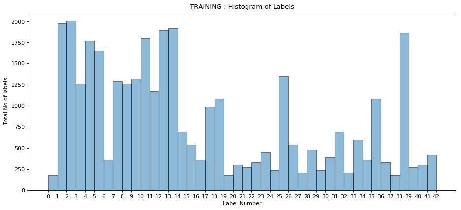
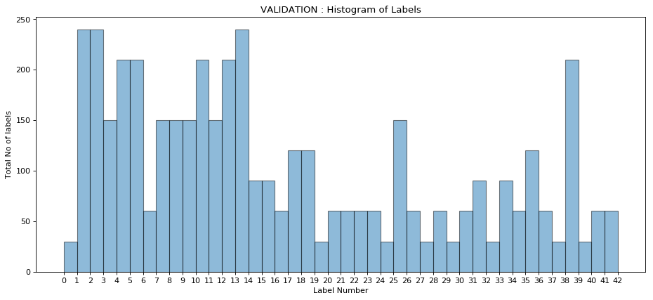
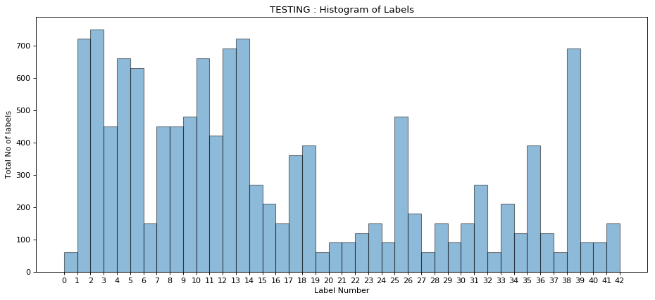
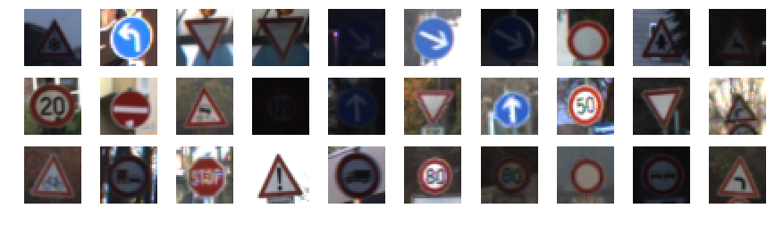
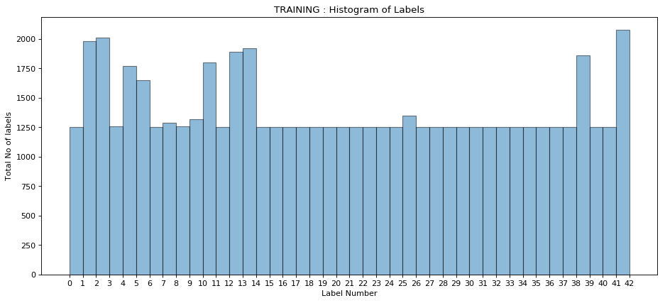

# **Traffic Sign Recognition** 

## Writeup

### Chundi Himakiran Kumar

---

## Rubric Points
### Here I will consider the [rubric points](https://review.udacity.com/#!/rubrics/481/view) individually and describe how I addressed each point in my implementation.  

---
### Writeup 

#### 1. This file is the Writeup  that includes all the rubric points and how I addressed each one. 

### Data Set Summary & Exploration

#### 1. The following is  a basic summary of the data set. 

I used the pandas library to calculate summary statistics of the traffic
signs data set:

* Number of training examples = 34799
* Number of validation examples = 4410
* Number of testing examples = 12630
* Image data shape = (32, 32, 3)
* Number of classes = 43

#### 2. Exploratory visualization of the dataset.

Here is an exploratory visualization of the data set. It is a histogram plot showing the distribution of images
from the training set.
Histogram of the Training Set

Histogram of the Validation Set

Histogram of the Testing Set

A random sample of images from the training, validation and test data set are shown below



### Design and Test a Model Architecture

#### 1. Pre-Processing the Data Set : Augmentation of Training Data set

The output histogram of three data sets shows that the images vary in frequency. Some of the images are very less in number
and this might affect the efficacy of the training portion. Hence we have chosen 1250 as the baseline for the minimum
number of images that should be present in the training data for each type of image. The following code augments the training data.
~~~~
# We shall try to augment the training set with the images corresponding to the labels poorly represented in the 
# label histogram of the raining data set
# To do that we choose 1250 as the baseline so that the training data set has minimum 1250 images of each type in it

# Augmenting training data set using num_labels and num_values
# This code goes thru the entire training set, and checks each image and its frequency.
# If it's frequency is less than 1250 we shall add copies of the same
# so that the total no of this images will be 1250.

num=1250
X_data_aug, y_data_aug = [],[]
for i in range(0,len(X_train)-1):
    img = X_train[i]
    label = y_train[i]
    #print("Label : {}".format(label))
    if(label in num_labels):
        index=np.where(num_labels==label)
        #print(index[0])
        num_of_images = num_values[index][0]
        #print(num_of_images)
        aug_number = 1250-num_of_images
        #print(aug_number)
        # If the num_of_images > 1250 the aug_number will be negative and code below
        # will not run
        for j in range(0,aug_number):
            X_data_aug.append(img)
            y_data_aug.append(label)
        # Below steps so that we dont augment the same image again
        num_labels = np.delete(num_labels,index[0])
        num_values = np.delete(num_values,index[0])
        #print(aug_labels)
        #print(aug_values)
X_train_aug,y_train_aug = np.array(X_data_aug),np.array(y_data_aug)
X_train = np.concatenate((X_train, X_train_aug))
y_train = np.concatenate((y_train, y_train_aug))
~~~~

Plotting a histogram of the augmented data set we can see now that all images which were earlier less
than 1250 have all been made up.


#### 2. Pre-Processing the Data Set : Augmentation of Validation Data set

After augmenting the Training data set we realize that the validation data set is now just 7 % of the new size
of the training data set. To get it upto 20% size of the new training data set we augment the validation data set
by radomly selecting images from the training data set and appending it to the validation data set. The code below
executes the same
~~~~
num = int((0.20 * len(X_train)) - len(X_valid))
print("Shortfall in Validation data : {}".format(num))
def augment_valid_data(num):
    X_valid_aug, y_valid_aug = [],[]
    for i in range(0,num):
        j = random.randint(0,len(X_train)-1)
        img =  X_train[j]
        label = y_train[j]
        X_valid_aug.append(img)
        y_valid_aug.append(label)
    return np.array(X_valid_aug),np.array(y_valid_aug)
X_valid_aug,y_valid_aug = augment_valid_data(num)
X_valid = np.concatenate((X_valid, X_valid_aug))
y_valid = np.concatenate((y_valid, y_valid_aug))

# Checking
print("Number of training examples =", len(X_train))
print("Number of labels =", len(y_train))
print("Number of validation examples =", len(X_valid))
print("Number of labels =", len(y_valid))
~~~~

#### 3. Pre-Processing the Data Set : Normalization of the Data sets

The mean of the data set is very high at 

``` Mean before normalizing 77.41467293511508 ```

Hence we normalize the data set by subtracting and dividing by 128.

Now the mean is an acceptable value close to zero

```Mean after normalizing -0.3951948881149292```

#### 2. Final model architecture 

My final model is the exact same LeNet Model taught in the class and is shown below

| Layer         		|     Description	        					| 
|:---------------------:|:---------------------------------------------:| 
| Input         		| 32x32x3 RGB image   							| 
| Convolution 3x3     	| 1x1 stride, valid padding, outputs 28x28x6 	|
| RELU					|												|
| Max pooling	      	| 2x2 stride,  outputs 14x14x6 				|
| Convolution 3x3	    | 1x1 stride, valid padding, outputs 10x10x16	|
| RELU					|												|
| Max pooling	      	| 2x2 stride,  5x5x16. 				|
| Flatten.				| Input = 5x5x16. Output = 400					|
| Fully connected		| Fully Connected. Input = 400. Output = 120	|
| RELU					|												|
| Fully connected		| Fully Connected. Input = 120. Output = 84	|
| RELU					|												|
| Fully connected		| Fully Connected. Input = 84. Output = 43	|
| tf.nn.softmax 		|								|
| tf.reduce_mean		|												|
| tf.train.AdamOptimizer|												|
| Optimizer.minimize	|												|
 


#### 3. Training the model.

To train the model, we firstly initailze the tensorflow global variables and then run the training operation.
The tunable hyper parameters were selected using trial and error and we settled down with a batchsize of 64
and 20 epochs.

#### 4.  Approach to solve the problem

We decided firstly that we would be using the LeNet model architecture to solve the problem and only resort to
another model if we fail to get the results with this model. We intially tried to run this model after only normalizing the
data sets. However this failed  to give us desirable results even after extensively tuning the hyper parameters especially
the learning rate. Then we watched this video which was referenced in the project instructions

[Q and A video]: <https://www.youtube.com/watch?v=ni95EfPILjI&feature=youtu.be> "Question Answer Video"

Then we realized that may be some images which were very less in number in the training set must be the reason the model is not performing well. Then we decided to augment the training data set such that all images are adequately represented  as discussed
above in pre-processing:augmentation. This gave us very good results. We also experimented with the contrast transform but
it was not giving us any extra benefit and hence we dropped it.

My final model results were:
* training set accuracy of 0.999
* validation set accuracy of 0.976 
* test set accuracy of 0.928


 

### Test a Model on New Images

#### 1. Choose five traffic signs found on the web and provide them in the report. 

Here are five traffic signs that I found on the web:
web_images/'
names = ['30kmph.jpg',\
         '50kmph.jpg',\
         'keepright.jpg',\
         'proadsign.jpeg',\
         'yield.jpg']

![30 Kmph][web_images/30kmph.jpg] ![50 Kmph][web_images/50kmph.jpg] ![Keep Right][web_images/keepright.jpg] 
![Priority Road Sign][web_images/proadsign.jpeg] ![yield][web_images/yield.jpg]


#### 2. The model's predictions on these new traffic signs and compare the results to predicting on the test set. 

Here are the results of the prediction:

| Image			        |     Prediction	        					| 
|:---------------------:|:---------------------------------------------:| 
| Speed limit 30 Kmph	| Speed limit (20km/h)							| 
| Speed limit 50 Kmph	| Speed limit 50 Kmph   						|
| keepright 			| keepright										|
| Priority Road 	 	| Speed limit (30km/h)			 				|
| Yield					| Yield											|

The traffic signs that were chosen were firstly not German, which was a mistake. They also were each of different sizes
and colors as well and of different nationalities. So a 60 % accuracy rate is probably good.
The model was able to correctly guess 3 of the 5 traffic signs, which gives an accuracy of 60%. This compares favorably to the accuracy on the test set of 93%.

#### 3. Describe how certain the model is when predicting on each of the five new images by looking at the softmax probabilities for each prediction. Provide the top 5 softmax probabilities for each image along with the sign type of each probability. 

The code for making predictions on my final model is located in the final part of the notebook.

The model is exteremely sure for the second third and fifth images with a probability of one all of which were
correctly predicted. For the first and fourth model the first probability is quite high but for the wrong results. 
Infact for the first the model is very sure that it is 20kmph whereas it was 30 kmph!!

The top five soft max probabilities imagewise are 

1. Speed limit 30 Kmph

| Probability         	|     Prediction	        					| 
|:---------------------:|:---------------------------------------------:| 
| .99					| Speed limit (20km/h)							| 
| 0.000004				| Bicycles crossing								|
| 0.000002				| Ahead only									|
| 0.000001				| Speed limit (120km/h)			 				|
| 00000004			 	| Dangerous curve to the right					|

2. Speed limit 50 Kmph

| Probability         	|     Prediction	        					| 
|:---------------------:|:---------------------------------------------:| 
| 1.0					| Speed limit (50km/h)							| 
| 0.00000001			| Speed limit (30km/h)							|
| 0.00000000000002		| Keep left										|
| 0.000000000000003		| Speed limit (80km/h)			 				|
| 0.00000000000000008	| Go straight or left							|

3. keepright

| Probability         	|     Prediction	        					| 
|:---------------------:|:---------------------------------------------:| 
| 1.0					| Keep Right									| 
| 0.0					| Yield											|
| 0.0					| Speed limit (20km/h)							|
| 0.0					| Speed limit (30km/h)			 				|
| 0.0					| Speed limit (50km/h)							|


4. Priority Road

| Probability         	|     Prediction	        					| 
|:---------------------:|:---------------------------------------------:| 
| 0.743243158			| Speed limit (30km/h)							| 
| 0.256756812			| Speed limit (80km/h)							|
| 0.00000001			| Children crossing								|
| 0.00000000002			| Dangerous curve to the left	 				|
| 0.0000000000009		| Road narrows on the right						|

5. Yield

| Probability         	|     Prediction	        					| 
|:---------------------:|:---------------------------------------------:| 
| 1.0					| Yield											| 
| 0.000000000004		| Priority road									|
| 0.000000000000002		| End of no passing by vehicles over 3.5 metric tons|
| 0.0000000000000000003	| End of all speed and passing limits			|
| 0.00000000000000000004| Speed limit (30km/h)|


